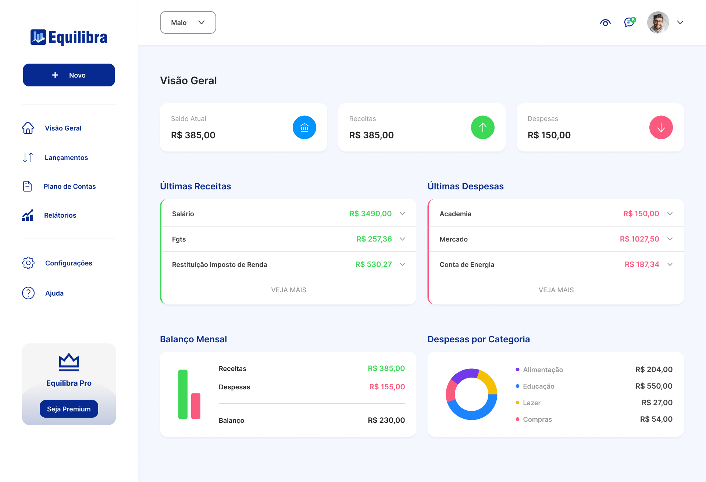
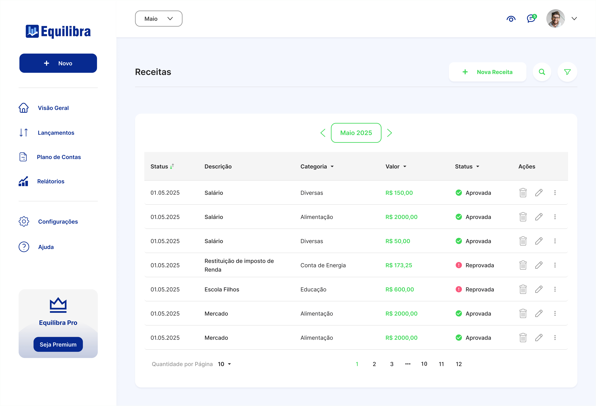
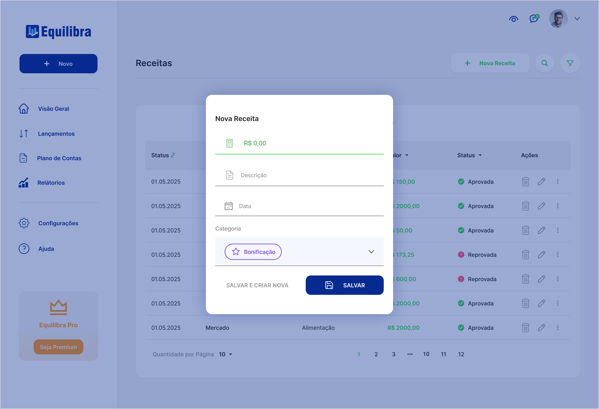

# Equilibra

**Equilibra** é um sistema web para controle pessoal de finanças. Com ele, você pode organizar receitas e despesas, visualizar seu saldo atual e acompanhar sua vida financeira de forma simples e intuitiva.

## ✨ Funcionalidades

- ✅ Visão geral com saldo, receitas e despesas
- ➕ Adição de novas entradas e saídas financeiras
- 🗂️ Classificação por categorias (plano de contas)
- 📅 Histórico com data, valor, descrição e status (pago/recebido)
- 📊 Relatórios financeiros mensais (em construção)
- 🎨 Suporte a tema claro, escuro e automático

## 🧪 Tecnologias Utilizadas

- HTML, CSS e JavaScript
- Ícones com [Bootstrap Icons](https://icons.getbootstrap.com/)
- Hospedagem via [Render](https://render.com/)

## 📂 Organização do Projeto

```
equilibra-front/
├── index.html
├── assets/
│   ├── css/
│   ├── js/
│   └── images/
├── README.md
````

## 📷 Captura de Tela

> Acesse [equilibra.onrender.com](https://equilibra.onrender.com) para ver o sistema em funcionamento.







## 🚀 Como rodar localmente

```bash
git clone https://github.com/andreantoniobr/equilibra-front.git
cd equilibra-front
````

## 🌐 Acesse

- 🔗 [equilibra.onrender.com](https://equilibra.onrender.com/)

